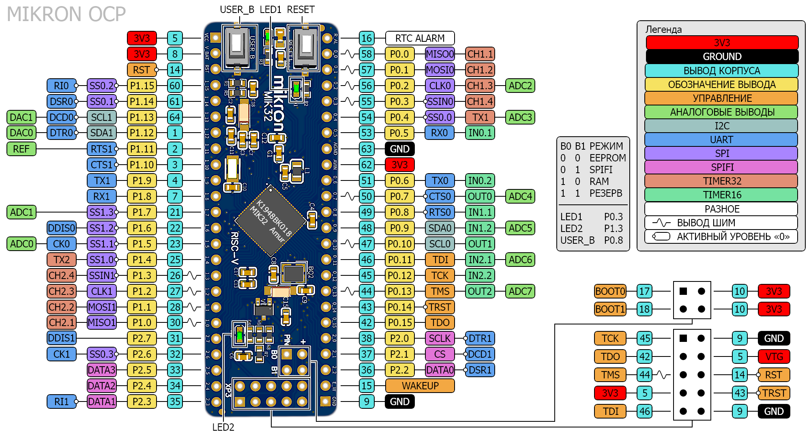
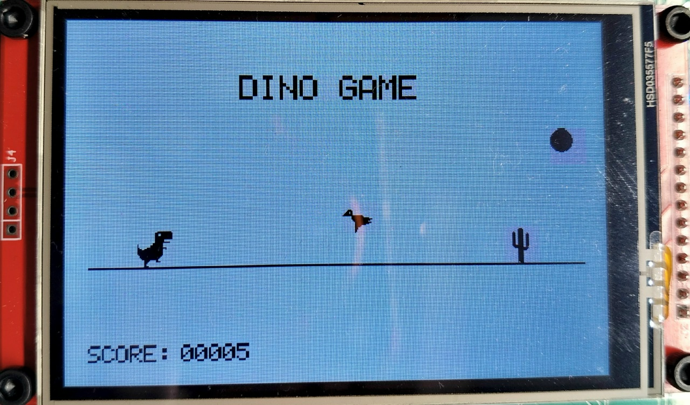
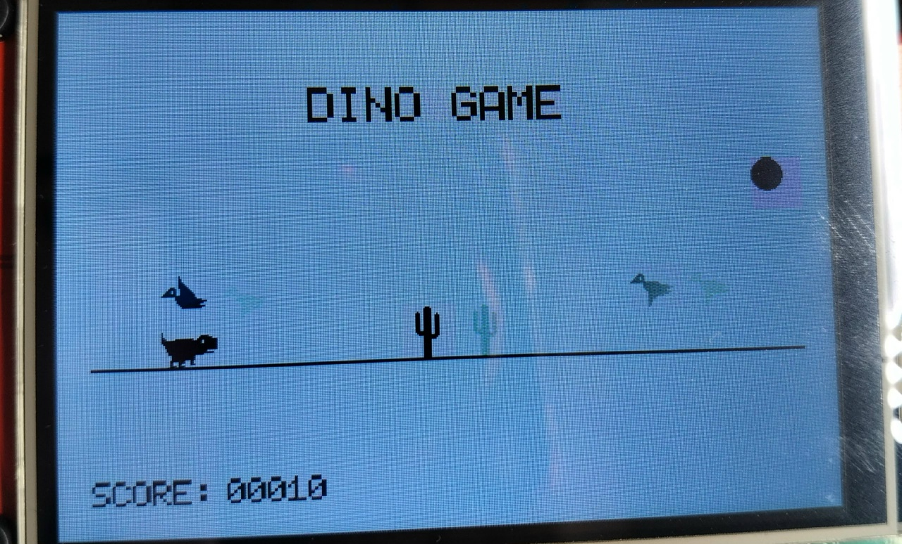
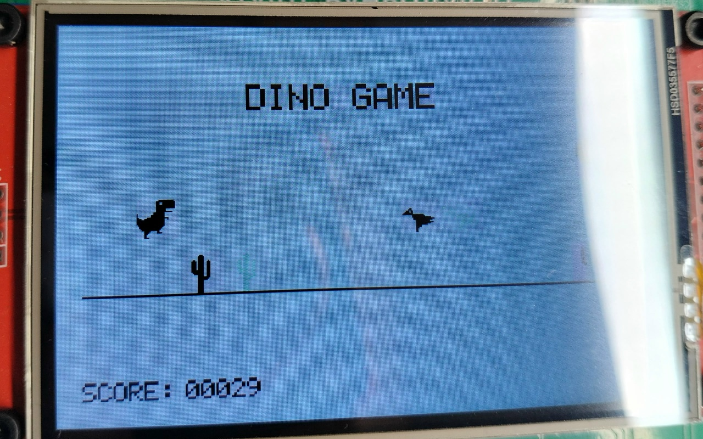
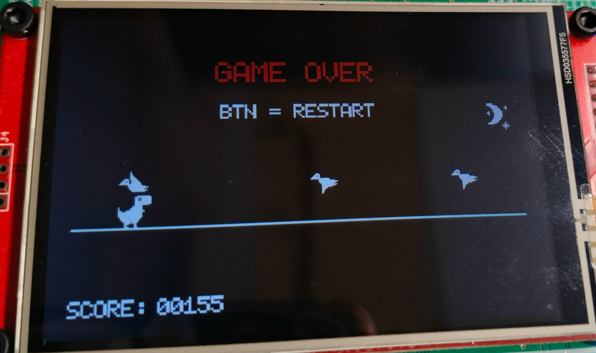
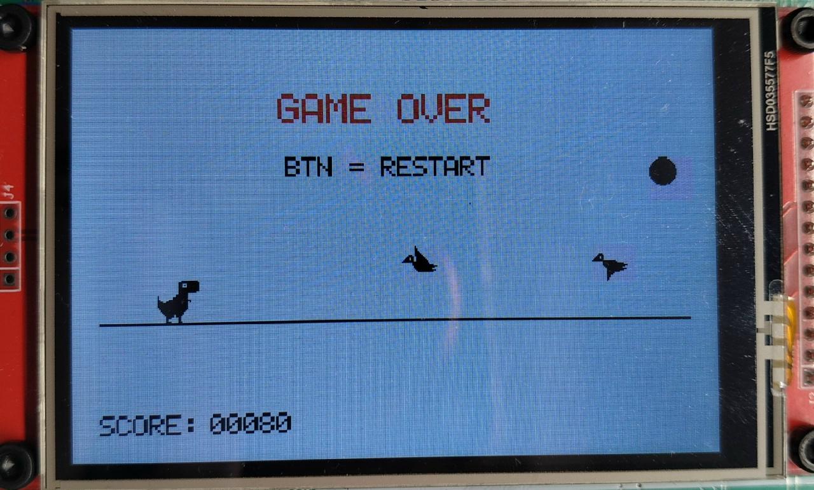

# MIK32 Dino Game 🦖

Игра Dino Game для микроконтроллера MIK32: управление через джойстик с выводом на TFT-дисплей ILI9341.

**Платформа:** отладочная плата DIP-MIK32, PlatformIO, `framework-mik32v2-sdk`.

***

Для запуска проекта достаточно собрать схему на макетной плате: микроконтроллер, дисплей и джойстик соединяются перемычками без пайки.

| Компонент | Описание |
|-----------|----------|
| **DIP-MIK32** | Отладочная плата с микроконтроллером MIK32 Амур — целевая платформа |
| **TFT-дисплей ILI9341** | Отображение игрового поля, спрайтов, счёта и состояний |
| **Аналоговый джойстик** | Чтение оси X для прыжка и приседа, кнопка — для перезапуска после проигрыша |
| **Макетная плата** | Сборка схемы без пайки |
| **Соединительные провода** | Подключение дисплея и джойстика к DIP-MIK32 на макетной плате |

***

## Подключение

Распиновка платы DIP-MIK32:

<div align="center">
  
  <br>
  <em>Распиновка платы DIP-MIK32</em>
</div>
<br>

Дисплей работает по шине SPI0: данные передаются по аппаратным линиям SPI, управляющие сигналы — через GPIO. Оси джойстика считываются по SPI1 через внешний АЦП (выбор канала линиями CS0–CS2), кнопка подключена отдельно к GPIO.

| Устройство | Линия | Подключение на DIP-MIK32 |
|---|---|---|
| **ILI9341** | CS | `GPIO_0 / PIN_4` |
| **ILI9341** | RS (DC) | `GPIO_0 / PIN_8` |
| **ILI9341** | RESET | `GPIO_0 / PIN_9` |
| **ILI9341** | LED | `GPIO_0 / PIN_10` |
| **Аналоговый джойстик** | Кнопка | `GPIO_0 / PIN_14` |
| **SPI-АЦП джойстика** | CS0, CS1, CS2 | `GPIO_1 / PIN_10, PIN_11, PIN_14` |

***

## Управление

Управление построено на оси X джойстика (пороги `1000` и `3000`). Кнопка используется для перезапуска игры.

| Действие | Ввод |
|---|---|
| Прыжок | отклонение джойстика (ось X < 1000) |
| Присед | отклонение джойстика (ось X > 3000) |
| Бег | нейтральное положение |
| Рестарт после Game Over | кнопка джойстика |

***

## Игровой процесс

Динозавр избегает препятствий на бегу: кактусы нужно перепрыгивать, высоко летящих птеродактилей — пропускать, низко летящих — проходить в приседе. Счёт растёт с каждым кадром, а скорость игры постепенно увеличивается.

Кадры игрового процесса:

<table>
  <tr>
    <td width="33%">
      <div align="center">
        <br>
      </div>
    </td>
    <td width="33%">
      <div align="center">
        <br>
      </div>
    </td>
    <td width="33%">
      <div align="center">
        <br>
      </div>
    </td>
  </tr>
</table>
<br>

Каждые 100 очков тема игры меняется - дневной режим  сменяется ночным и обратно:

<table>
  <tr>
    <td width="50%">
      <div align="center">
        <br>
        <em>Ночной режим</em>
      </div>
    </td>
    <td width="50%">
      <div align="center">
        <br>
        <em>Дневной режим</em>
      </div>
    </td>
  </tr>
</table>
<br>

***

## Структура проекта

```
mik32-dino-game/
├── src/                    # Исходники прошивки
│   ├── main.c              # Инициализация периферии и игровой цикл
│   ├── system_config.c     # Конфигурация тактирования микроконтроллера
│   ├── dino_game.c         # Логика и отрисовка Dino Game
│   ├── lcd.c               # Драйвер дисплея на базе ILI9341
│   ├── bus_spi.c           # Драйвер шины SPI
│   ├── bgpio.c             # Драйвер GPIO
│   ├── bdma.c              # Драйвер DMA
│   ├── joystick.c          # Драйвер джойстика
│   └── font.c              # Таблица символов 5×7
├── include/                # Заголовки модулей
├── image/                  # Исходные PNG-спрайты
├── docs/                   # Иллюстрации к документации
└── platformio.ini          # Конфигурация сборки
```

***

## Дополнительная информация

- [Документация ILI9341](https://cdn-shop.adafruit.com/datasheets/ILI9341.pdf)
- [Документация MIK32](https://docs.mikron.ru/)
- [Отладочная плата DIP-MIK32](https://docs.mikron.ru/wiki/boards/dip.html)